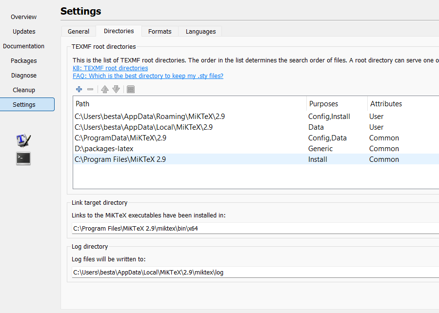
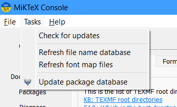

# 0. 

Jetter un coup d'oeuil dans la documentation, permettra de connaitre les packages nécessaires à de beaux et de bon rapports et leurs utilisations. 
Aussi pas besoin d'aller dans le ctan, la plupart des datasheets sont déjà présentes dans un dossier.

Inspirez vous de la documentation pour faire vos propres documents.
Si vous êtes en recherche d'une installation rapide et simple, suivez le tutoriel ci-dessous. 

# 1. Cloner le dossier git 
je conseille git fork pour avoir un apercu visuel de git

# 2. Installer les logiciels
- Miktek
- VScode ( Overleaf est payant pour des documents qui sont longs =  rapports de pfe, commencer sur VScode **c'est avoir moins de temps de chargement et économiser de l'argent à long terme**)

## Setup Miktek
- ajouter le dossier (*package-latex*) à miktek => setting/directories 
- Update la database (dans un des onglets)

## Setup VSCode
- extention latex workshop (James-Yu.latex-workshop) + ltex languagetool 
- extension live share qui permet de modifier la même chose ==> il faut un compte github cependant (desavantage :  moyen fiable)
- copie des **usersnippet**: 
    - source :   [latex.json](<visual studio json/latex.json>)
    - destination :  *file+preference+user snippet + latex json*
- copie des paramètres ltex and latex workshop:
    - source : [setting.json](<visual studio json/Settings.json>)
    - destination : *Preferences: Open User Settings (JSON)*

# Synchronisation de Miktek et Vscode 
    Quand les extensions ont démarrés => reload pour qu'elles voient le pdflatex.exe de miktek

> After installing TeX Live, you must add the directory of TeX Live binaries to your PATH environment variable except on Windows. See the official document. LaTeX Workshop never touches the variable. If VS Code cannot find executables of TeX, it means that the setting of your system is broken. For the ways of setting environment variables on Windows, see link or link. On macOS and Linux, see the documentation by the rbenv dev team. Very detailed information is also available on stackoverflow for macOS.

# svgtopng.exe

C'est un utilitaire qui transforme des illustrations .svg  en .png qui peuvent être intégrés dans le document. 
Les images svg sont modifiables avec des applications comme **inkscape**. (Schéma très simple à faire). Quand l'option *svg* du package main est activé, l'utilitaire est lancé à chaque compilation, transformant les seulement les images .svg qui viennent d'être modifiées.

Pour que cela fonctionne il faut mettre les images dans un dossier *.\pictures* et les svg dans un dossier *.\pictures\*\svg*

Je conseille d'ajouter le chemin aux variables d'environnement, pour qu'il soit accessible de n'importe ou.

# Premier document

utiliser le snippet :  *main* qui génère le corps du document principal. 
Lors de la première compilation (*appuyer sur triangle vert*), cela devrait compiler et donner le fichier [test](test.pdf). 
Après il faut commencer à rédiger. Je recommande la structure suivante : 
- main.tex *peut prendre un autre nom*
- biblio.bib *En cas de bibliographie*
- picture
    - svg
- Appendix
- src_tex
